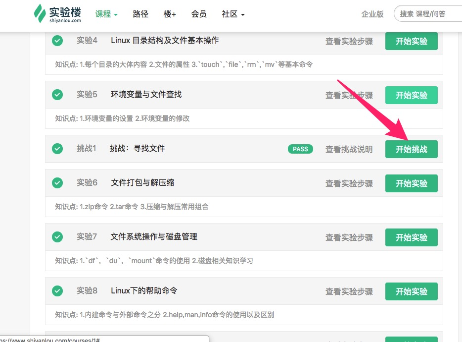

# 开始挑战

## 什么是挑战

挑战是可以自动评测实验结果的测验（可理解为考试或课后练习），类似 OJ 评测系统。实验文档会给出一个任务和提示，在实验环境中完成任务后点击 `提交结果` 按钮，系统会自动对你的提交结果进行测试，并返回通过（PASS）或失败（FAIL）的结果。

挑战侧重于评估解决问题的能力、实际的动手能力以及项目工程的开发能力等。

## 开始挑战

点击课程中挑战后面的 `开始挑战` 就可以进入到挑战的环境。

## 挑战和实验的区别

1. 实验文档不同：实验侧重于遵循实验文档，在模仿中完成目标；挑战只给出题目和必要的提示，需要通过自己的思考解决问题。
2. 实验环境不同：挑战的实验环境中无法使用所有会员功能。

## 挑战与 OJ（Online Judge） 的区别

1. OJ 主要侧重算法，挑战侧重工程能力和解决问题能力的评估和锻炼，更能反映出综合能力。
2. 挑战给出更真实的开发环境和企业问题场景，而不是一个简单的代码输入框。
3. 挑战支持的范围更广泛，可以覆盖 OJ 无法支持的技术领域。例如 Linux 运维、数据库管理、项目调试debug等系统化的领域。暂时不能支持 Windows、移动开发领域的在线评测。

## 挑战举例

### 简单的

为实验环境中提供的数据库，建立提高搜索性能的索引。

### 中等难度

提供一个运行有错误的 C 语言程序（> 200行代码），通过 gdb 调试跟踪发现问题并修复。

### 较难的

有一个无法访问的网站，作为网站管理员的你，需要找到问题并解决它，让网站可以恢复正常访问。

## 挑战在楼赛中的应用

实验楼的**「 [楼赛](https://www.shiyanlou.com/contests/) 」**是完全基于挑战设计的产品，每期比赛持续一周，包含不同主题，结束后仍然可以随时挑战，例如以下比赛内容：

+ [楼赛第1期 Linux项目挑战](https://www.shiyanlou.com/contests/lou1/challenges)
+ [楼赛第2期 数据库项目挑战](https://www.shiyanlou.com/contests/lou2/challenges)
+ [楼赛第3期 Python项目挑战](https://www.shiyanlou.com/contests/lou3/challenges)

